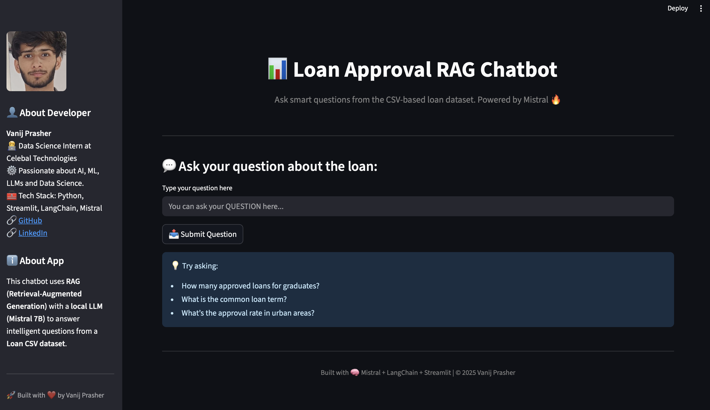
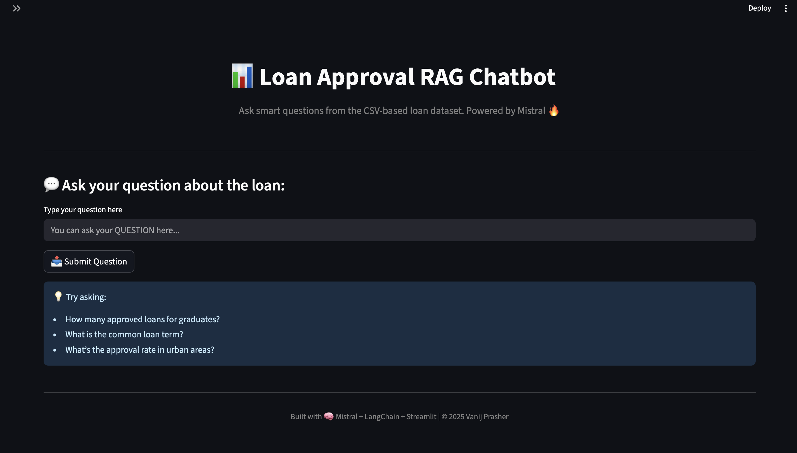
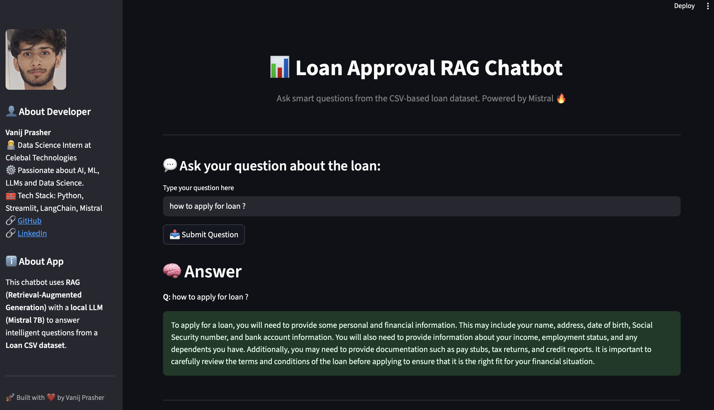
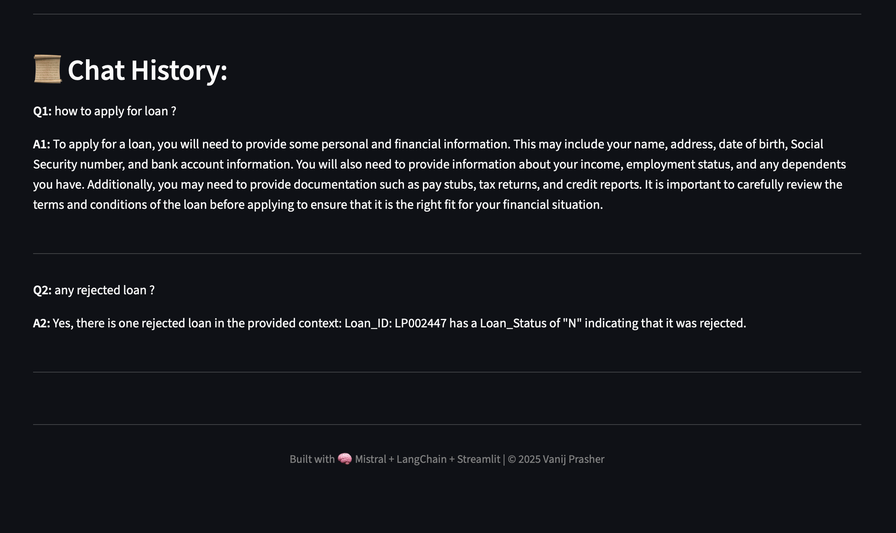

# 📊 Loan RAG Q&A Chatbot

This is an interactive chatbot that uses **RAG (Retrieval-Augmented Generation)** to intelligently answer user questions from a **Loan CSV dataset**. It combines local **LLMs (like Mistral 7B)** with **LangChain**, **FAISS vector store**, and **Streamlit** to provide insightful, document-based answers.

---

## 💡 Features

- 💬 Ask questions from a loan dataset in natural language.
- 🔍 Retrieves relevant chunks using **FAISS** vector store.
- 🧠 Generates context-aware responses using **Llama.cpp-powered Mistral 7B** model.
- 📜 Maintains chat history in session.
- 📁 Fully local, privacy-respecting architecture.
- 🎨 Clean and informative **Streamlit UI**.

---

## 🛠️ Tech Stack

| Technology             | Usage                        |
|------------------------|------------------------------|
| Python                 | Backend logic                |
| Streamlit              | Frontend UI                  |
| LangChain              | RAG orchestration            |
| LlamaCpp               | Local LLM inference engine   |
| FAISS                  | Vector store for retrieval   |
| HuggingFace Embeddings | Sentence embedding           |
| dotenv                 | Secure config loading        |

---

## 📂 Folder Structure

```bash
.
├── app.py                    # Streamlit frontend
├── rag_chatbot.py           # RAG logic using LangChain
├── data/
│   └── Training Dataset.csv.xls
├── .env                     # Model path and secrets
└── requirements.txt         # Python dependencies
```
---

## ⚙️ Setup Instructions

1. **Clone the repository**:

```bash
git clone https://github.com/Vanij-Prasher/Loan-RAG-Bot.git
cd Loan-RAG-Bot
```
2.	**Install dependencies**:
```bash
pip install -r requirements.txt
```
3.	**Download and setup your local model (e.g., Mistral-7B) and update the .env**:
```bash
MODEL_PATH=/absolute/path/to/your/mistral-7b.Q4_K_M.gguf
```
4.	**Run the chatbot**:
```bash
streamlit run app.py
```
### 🙋‍♂️ **About the Developer**

**Vanij Prasher**
👨‍💻 Data Science Intern at Celebal Technologies
💡 Passionate about AI, LLMs,Data Science and Real-world Applications
📫 GitHub- https://github.com/Vanij-Prasher | LinkedIn- https://www.linkedin.com/in/vanij-prasher/

---

## 📸 Screenshots

### 🔹 Homepage UI


### 🔹 Basic UI


### 🔹 Answer


### 🔹 Chat History

=======


---

Made with 💙 by Vanij Prasher | Celebal Technologies – Data Science Internship 2025

