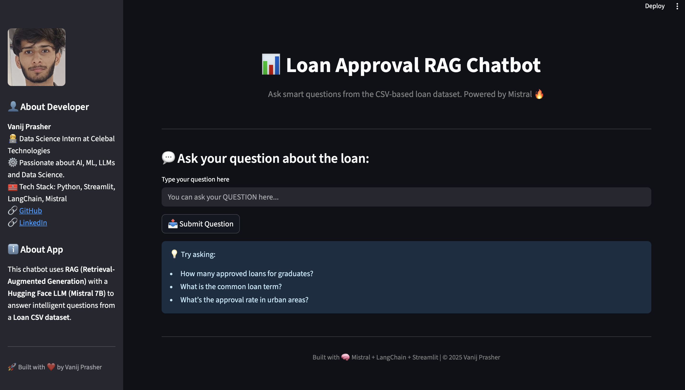
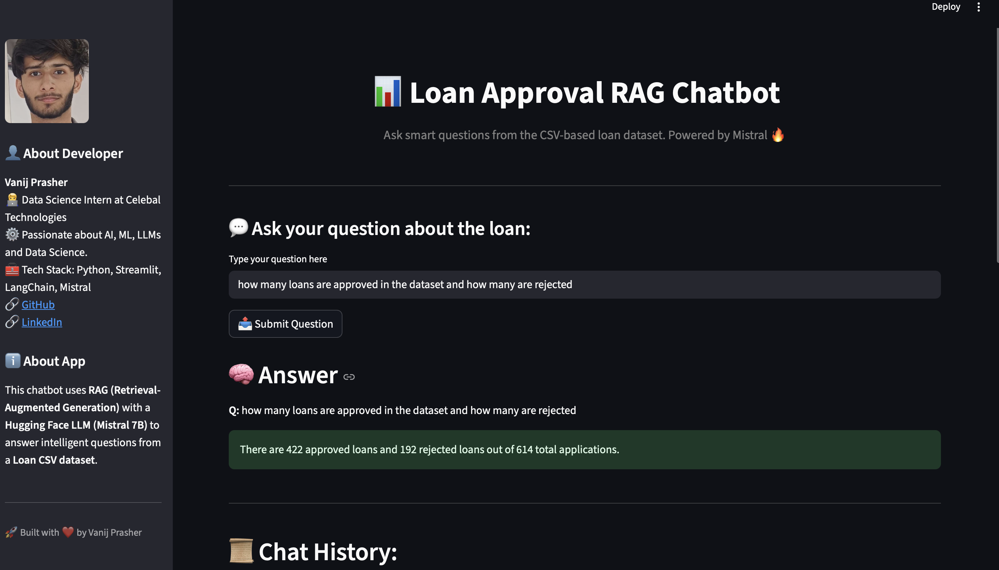
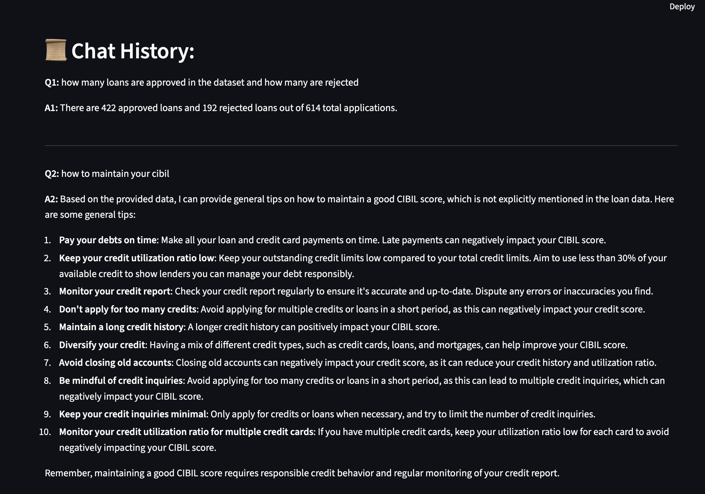

# 📊 Loan Approval RAG Chatbot

A smart AI chatbot that answers user queries based on a **loan approval dataset** using **Retrieval-Augmented Generation (RAG)** and **Groq's LLaMA 3 model**. Built with 🔥 **LangChain**, **Groq**, **FAISS**, and **Streamlit**.

---

## 🚀 Demo

> ⚙️ Hosted via Streamlit  
> 🔗 [Click here to try the chatbot](https://your-streamlit-link)  
> _(Replace with actual link after deployment)_

---

## 🧠 Features

- ✅ Asks natural language questions about the loan dataset.
- 🔍 Uses **LangChain RAG** to retrieve and generate contextual answers.
- 📂 Dataset loaded from CSV and indexed using **FAISS vector store**.
- 🦙 Powered by **Groq's LLaMA 3** LLM for blazing-fast responses.
- 🧾 Uses `pandas` for quick stats and logic-based shortcut answers.
- 🌐 Hosted with **Streamlit** for easy web access.

---

## 🛠️ Tech Stack

| Layer              | Tools / Libraries                           |
|-------------------|---------------------------------------------|
| 💬 Language Model | [Groq LLaMA3 8B](https://console.groq.com)  |
| 🧠 Framework      | LangChain, FAISS, HuggingFace Embeddings    |
| 🗃️ Data Loading   | `pandas`, `langchain_community` CSV Loader  |
| 🌐 UI              | Streamlit                                   |
| 🔐 Secrets         | Python Dotenv + Streamlit Secrets           |
| 📄 File Format     | `CSV` dataset with loan records             |

---

## 📁 Project Structure
```
📦 loan-rag-chatbot/
├── app.py                 # Main Streamlit app
├── chatbot.py             # Core logic: RAG, LLM, embeddings
├── dataset.csv            # Loan dataset (used for QA)
├── requirements.txt       # Python dependencies
├── .env                   # Local secret file (GROQ_API_KEY)
└── README.md              # Project overview
```
---

## ⚙️ Setup & Run Locally

### 1. Clone the Repository
```bash
git clone https://github.com/yourusername/loan-rag-chatbot.git
cd loan-rag-chatbot
```

### 2. Install Requirements
```
pip install -r requirements.txt
```

### 3. Set Up Environment Variables
Create a .env file:
```
GROQ_API_KEY=your-groq-api-key
```

### 4. Run the App
```
streamlit run app.py
```
### ☁️ Deploy to Streamlit Cloud
	1.	Push this repo to GitHub.
	2.	Go to streamlit.io/cloud.
	3.	Create a new app:
	•	Repo: this repo
	•	Branch: main
	•	File: app.py

## 📸 Screenshots

### 🔍 Chatbot UI



### 📊 Answering a Question



### History


## 👨‍💻 Developed By

**Vanij Prasher**
🧑‍💻 Data Science Intern @ Celebal Technologies
[](https://github.com/Vanij-Prasher)
[](https://linkedin.com/in/vanij-prasher)
